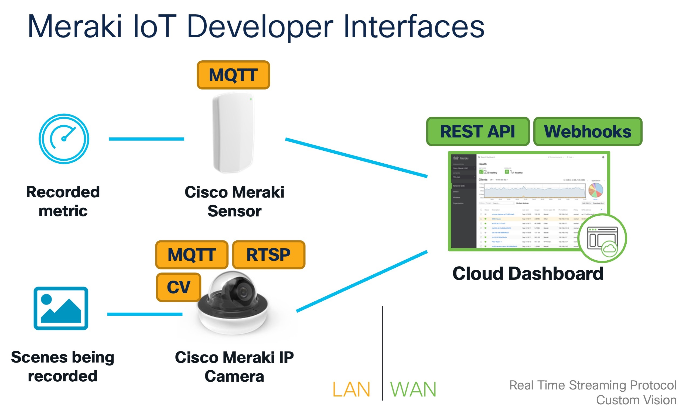

# Meraki IoT Script Collection: MV Cameras and MT Sensors

This script collection helps you getting started to get data out of Meraki MV cameras and Meraki MT sensors from the Cloud and via MQTT locally.



## Prerequisites & Installation

1. Python dependencies: Install on your own the required Python libraries which are *different* for each script.

2. Run the Mosquitto MQTT broker (for MQTT scripts only)

```
docker pull ecplipse-mosquitto:1.6
docker run -p 1883:1883 eclipse-mosquitto:1.6
```

3. Set the MQTT broker configuration on the Meraki dashboard (for MQTT scripts only).

## MT sensor scripts

### Get historical sensor readings from MT sensors

**Script**: `mt_get_historical_sensor_readings.py`

Get historical sensor readings based your defined timespan and granularity.

### Get latest sensor reading from MT sensors

**Script**: `mt_get_latest_sensor_reading.py`

Get the latest sensor reading from your desired sensor.

## MV camera scripts

### Machine learning inference with RTSP stream

**Script**: `mv_custom_ml_model_inference_tensorflow.py`

This script shows how you can get the live video stream from the MV camera and check the received video frame against your ML model built with Keras/Tensorflow.

In this example, the image will be cropped at first and then predicted against the model.

### Machine learning inference on MV camera (Custom Vision)

**Script**: `mv_get_mqtt_custom_vision_coco.py`

Deploy your own ML model directly on the camera and get the object detections via MQTT stream from the camera. You can find the pre-trained tflite model in the folder `model`.

### Getting MQTT data from MV camera:
 
**Script**: `mv_get_mqtt_data.py`

Connecting via paho MQTT client to the MQTT broker (e.g. Mosquitto) and getting all plain MQTT topics / sensor data from the MV camera.

Try out this [fire alarm video](https://www.youtube.com/watch?v=2yMfNQPE1mE) for the MV camera to record the audio and detect the fire alarm.

Sample Output:

```
Lux: 7.0
In zone Zone_Right are 1 person(s).
ALARM! fireAlarm
Lux: 7.0
Lux: 7.0
Audio Level (dB): -45
Lux: 7.0
Lux: 7.0
In zone Zone_Right are 1 person(s).
ALARM! fireAlarm
Lux: 7.0
Lux: 7.2
In zone Zone_Right are 1 person(s).
Lux: 7.0
Audio Level (dB): -42
```

### Get RTSP stream from MV camera

**Script**: `mv_read_rtsp_stream.py`

Simply receive the RTSP video stream from the MV camera with OpenCV.

## MV camera + MT sensor scripts

### Get camera snapshot when door sensor got triggered

**Script**: `mv-mt_get_snapshot_when_door_was_opened.py`

Specify the serial number of the MT door sensor and also the serial number of the MV camera where the snapshots should be taken.

The snapshots will then be downloaded, the name of the .jpeg file is the UNIX timestamp.

## Versioning

**2.0** - Added custom vision script + videos.

**1.0** - Inital commit with 6 sample scripts.

## Authors

* **Flo Pachinger** - *Initial work* - [flopach](https://github.com/flopach)

## License

This project is licensed under the Cisco Sample Code License 1.1. - see the [LICENSE.md](LICENSE.md) file for details

## Further Links

* [Cisco DevNet Website](https://developer.cisco.com)
* [MV Sense API](https://developer.cisco.com/meraki/mv-sense/#!overview)